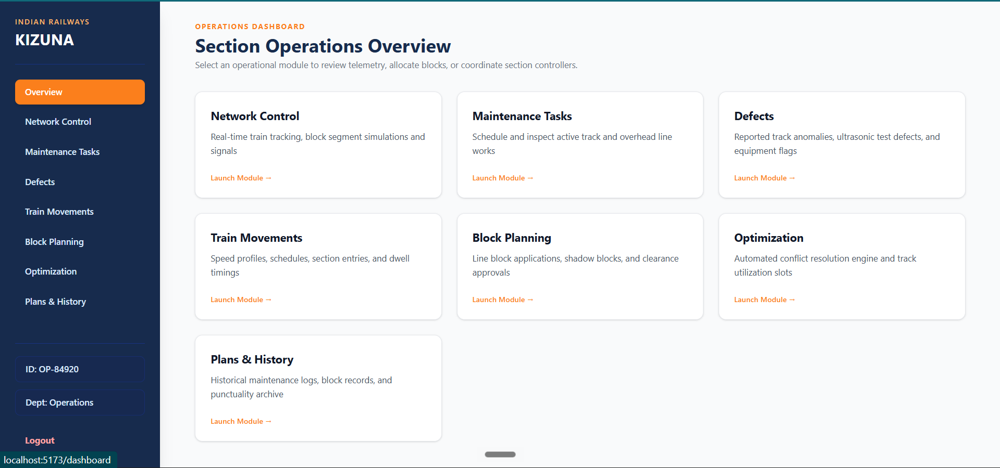
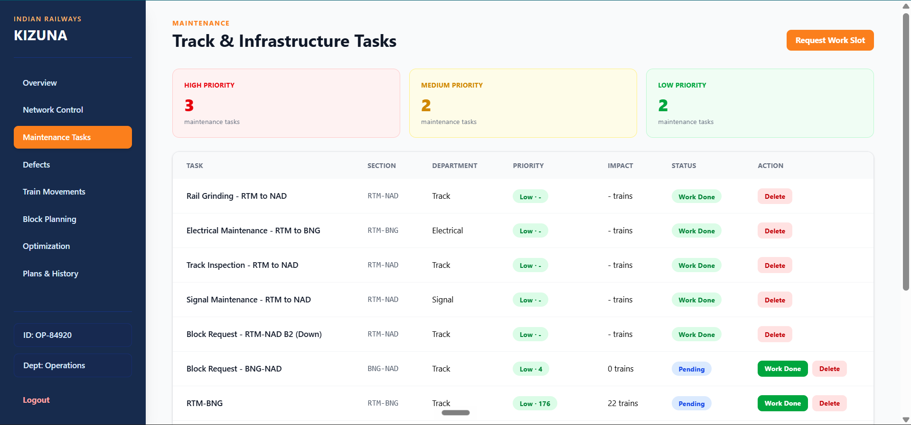

# Kizuna

## AI-Powered Automatic Block Planning to Maximize Asset Availability for Train Operations

**Smart India Hackathon 2026 — SIH26027**  
**Ministry of Railways | Software | Transportation & Logistics**

---

## Overview

Kizuna is an AI-assisted railway maintenance planning platform designed to optimize maintenance block scheduling while minimizing conflicts with train operations.

The system combines maintenance requirements, asset defects, railway timetable data, train impact, corridor availability, departmental compatibility, and constraint-based optimization into a unified planning workflow.

Instead of planning maintenance activities independently across departments, Kizuna identifies opportunities to coordinate compatible activities and consolidate them into joint maintenance blocks.

The platform supports:

- Daily block optimization
- Joint multi-department maintenance blocks
- Weekly maintenance planning
- Monthly maintenance planning
- Maintenance priority scoring
- Asset defect management
- Train impact analysis
- Corridor availability analysis
- Role-based administration

---

## Problem Statement

Railway maintenance activities are performed by multiple departments such as Track, Signal, and Electrical.

When these activities are planned independently, multiple departments may compete for the same railway corridor and maintenance windows.

This can result in:

- Conflicting maintenance activities
- Repeated blocking of the same corridor
- Under-utilization of available maintenance windows
- Increased asset downtime
- Higher operational impact
- Poor coordination between departments

The objective of Kizuna is to intelligently coordinate maintenance activities while considering train operations, corridor availability, task priority, and departmental compatibility.

---

## Solution

Kizuna converts independent maintenance requirements into a coordinated railway-aware optimization problem.

```text
TMS / SMMS / TDMS / COA
          |
          v
   Data Normalization
          |
          v
      PostgreSQL
          |
          v
Maintenance + Defects
          |
          v
    Priority Engine
          |
          v
      Train Impact
          |
          v
 Corridor Availability
          |
          v
 Joint Block Builder
          |
          v
     CP-SAT Solver
          |
          v
 Optimized Block Plan
          |
     +----+----+
     |         |
     v         v
  Weekly    Monthly
  Planning  Planning
     |         |
     +----+----+
          |
          v
    Kizuna Dashboard
```

---

# Key Features

## 1. Maintenance Management

Kizuna allows maintenance teams to create and manage maintenance tasks using:

- Section
- Department
- Criticality
- Severity
- Urgency
- Duration
- Description
- Status

Maintenance tasks can be:

- Created
- Viewed
- Prioritized
- Updated
- Completed
- Deleted

---

## 2. Explainable Priority Engine

Kizuna calculates maintenance priority using an explainable weighted model.

```text
Priority Score =
Criticality × Severity × Urgency × Train Impact
```

Each input factor is converted into a numerical weight.

For example:

```text
Criticality = 3
Severity = 3
Urgency = 3
Train Impact = 20

Priority Score
= 3 × 3 × 3 × 20
= 540
```

The prototype categorizes scores as:

| Score | Priority |
|---:|---|
| >= 400 | High |
| 300–399 | Medium |
| < 300 | Low |

The thresholds are configurable and can be calibrated using historical railway maintenance data.

### ML Approach

Production historical labelled maintenance data was not available for the prototype.

Therefore, Kizuna currently uses an explainable weighted baseline rather than claiming a trained production ML model.

The priority module is designed to be modular so that a trained ML risk model can replace or augment the current approach when sufficient historical data becomes available.

---

## 3. Defect Management

Kizuna supports asset defect management using:

- Asset ID
- Asset Type
- Railway Section
- Description
- Source System
- Severity
- Criticality
- Status

Example:

```text
Asset ID: SIG-NAD-002
Asset Type: Signal
Section: NAD-UJN
Severity: High
Criticality: High
Status: Open
```

Defects can be used as additional maintenance planning and prioritization inputs.

---

## 4. Train Timetable Integration

Kizuna uses railway timetable and train-stop data to understand train movement across railway sections.

The prototype dataset contains:

```text
Stations      : 7
Trains        : 42
Train Stops   : 188
```

Train-stop information is used to determine section occupancy and identify trains that may be affected by maintenance activity.

This makes maintenance scheduling railway-operation aware rather than assigning arbitrary maintenance slots.

---

## 5. Train Impact Analysis

For every maintenance section, Kizuna calculates the number of scheduled trains potentially affected by blocking that section.

Example prototype results:

```text
RTM-NAD → 20 trains
RTM-BNG → 22 trains
NAD-UJN → 20 trains
```

Train impact is then incorporated into the priority engine.

This allows maintenance tasks with greater operational impact to receive stronger scheduling priority.

---

## 6. Corridor Availability

Kizuna derives feasible maintenance windows from train occupancy.

For example:

```text
RTM-NAD

Available Window:
07:48 – 12:45
```

The optimization engine schedules maintenance activities inside feasible windows while avoiding known train occupancy periods.

---

# 7. Constraint-Based Optimization

The core scheduling engine uses:

**Google OR-Tools CP-SAT**

Railway block planning is a constraint scheduling problem because multiple operational and maintenance constraints must be satisfied simultaneously.

The optimizer considers:

- Maintenance priority
- Train impact
- Train occupancy
- Corridor availability
- Task duration
- Same-section conflicts
- Department compatibility
- Joint block opportunities

---

## Hard Constraints

### Corridor Availability

Maintenance activities must be scheduled inside feasible corridor availability windows.

### Task Duration

Every task must receive its required maintenance duration.

### Train Occupancy

Maintenance cannot be scheduled over unavailable train-occupied periods.

### Same-Section Conflicts

Incompatible maintenance activities on the same physical section cannot overlap.

### Department Compatibility

Compatible departments may be considered for joint execution when the configured compatibility rules permit it.

---

# 8. Joint Maintenance Blocks

One of Kizuna's key features is coordinated multi-department maintenance.

When compatible maintenance activities:

1. Belong to the same physical railway section
2. Belong to compatible departments
3. Fit within the same feasible maintenance window

the optimizer can consolidate them into a joint maintenance block.

Example:

```text
Section: RTM-NAD

Track Maintenance
        +
Signal Maintenance
        =
Joint Block JB-001
```

Example prototype result:

```text
JB-001

Section:
RTM-NAD

Time:
02:25 – 02:55

Departments:
Signal + Track
```

This reduces repeated blocking of the same corridor and improves coordination between maintenance departments.

---

# 9. Department Compatibility

Kizuna uses a configurable department compatibility layer.

Current prototype configuration:

```python
COMPATIBLE_DEPARTMENTS = {
    frozenset({"Track", "Signal"}),
    frozenset({"Track", "Electrical"}),
    frozenset({"Signal", "Electrical"}),
}
```

The compatibility matrix is configurable according to railway operational procedures, engineering rules, and safety requirements.

The prototype does not assume that every combination of maintenance activities is operationally safe by default.

---

# 10. Physical Section Normalization

Railway sections may be represented in both directions.

For example:

```text
RTM-NAD
NAD-RTM
```

represent the same physical railway corridor.

Kizuna normalizes bidirectional sections so that:

- Conflict detection
- Joint block generation
- Corridor-level scheduling

operate on the same physical section.

This prevents the system from incorrectly treating opposite-direction representations as independent corridors.

---

# 11. Weekly Planning

Kizuna supports a seven-day maintenance planning horizon.

The weekly planner distributes pending maintenance activities across:

```text
7 Days
```

The generated plan includes:

- Planning date
- Number of tasks
- Total duration
- Assigned tasks
- Department
- Section
- Status

---

# 12. Monthly Planning

Kizuna also supports a 30-day maintenance planning horizon.

The monthly planner distributes pending maintenance activities across:

```text
30 Days
```

This provides higher-level workload planning in addition to detailed block-level optimization.

---

# 13. Admin Portal

Kizuna includes a role-based administration layer.

## User Management

Administrators can:

- View users
- Create users
- Delete users
- Monitor user accounts

## Department Monitoring

Department-level maintenance information can be monitored for:

- Track
- Signal
- Electrical

## Railway Network

Administrators can inspect railway network and timetable data.

## Data Management

Administrators can monitor maintenance and planning data.

## System Status

The admin portal provides backend health and system status information.

---

# System Architecture

```text
                    +----------------------+
                    | Railway Data Sources |
                    +----------------------+
                    | TMS                  |
                    | SMMS                 |
                    | TDMS                 |
                    | COA                  |
                    +----------+-----------+
                               |
                               v
                    +----------------------+
                    | Data Normalization   |
                    +----------+-----------+
                               |
                               v
                    +----------------------+
                    |      PostgreSQL      |
                    +----------+-----------+
                               |
              +----------------+----------------+
              |                                 |
              v                                 v
     +------------------+             +------------------+
     | Maintenance Data |             | Defect Data      |
     +--------+---------+             +--------+---------+
              |                                |
              +----------------+---------------+
                               |
                               v
                    +----------------------+
                    |    Priority Engine   |
                    +----------+-----------+
                               |
                               v
                    +----------------------+
                    |     Train Impact     |
                    +----------+-----------+
                               |
                               v
                    +----------------------+
                    | Corridor Availability|
                    +----------+-----------+
                               |
                               v
                    +----------------------+
                    |  Joint Block Builder |
                    +----------+-----------+
                               |
                               v
                    +----------------------+
                    |     CP-SAT Solver    |
                    +----------+-----------+
                               |
                               v
                    +----------------------+
                    | Optimized Block Plan |
                    +----------+-----------+
                               |
                   +-----------+-----------+
                   |                       |
                   v                       v
           Weekly Planning        Monthly Planning
                   |                       |
                   +-----------+-----------+
                               |
                               v
                    +----------------------+
                    |    Kizuna React UI   |
                    +----------------------+
```

---

# Technology Stack

| Layer | Technology |
|---|---|
| Frontend | React 19 |
| Build Tool | Vite |
| Styling | Tailwind CSS |
| Backend | FastAPI |
| Language | Python |
| Database | PostgreSQL |
| ORM | SQLAlchemy |
| Optimization | Google OR-Tools CP-SAT |
| Authentication | JWT |
| Password Security | bcrypt |
| Data | Railway timetable and maintenance datasets |

---

# API Architecture

## Railway Data

```http
GET /api/trains/stations
GET /api/trains/trains
GET /api/trains/train-stops
```

## Maintenance

```http
GET    /api/maintenance
POST   /api/maintenance
GET    /api/maintenance/priorities
GET    /api/maintenance/{task_id}
PATCH  /api/maintenance/{task_id}
DELETE /api/maintenance/{task_id}
GET    /api/maintenance/{task_id}/conflicts
```

## Defects

```http
GET  /api/defects
POST /api/defects
GET  /api/defects/priorities
```

## Corridor Availability

```http
GET /api/corridor-availability/{section_from}/{section_to}
```

## Optimization

```http
POST /api/optimizer/run
```

## Planning

```http
POST /api/planning/weekly
POST /api/planning/monthly
GET  /api/planning/tasks
```

## Authentication

```http
POST /api/admin/login
GET  /api/admin/me
```

## Administration

```http
GET    /api/admin/users
POST   /api/admin/users
DELETE /api/admin/users/{user_id}
GET    /api/admin/department-data
```

## Health

```http
GET /api/health
```

---

# User Interface

Kizuna provides a dashboard-oriented interface designed around the railway maintenance planning workflow.

The primary workflow is:

```text
Dashboard
    ↓
Maintenance
    ↓
Defects
    ↓
Train Movements
    ↓
Block Planning
    ↓
Optimization
    ↓
Weekly / Monthly Planning
```

---

# UI / UX Screenshots

## Login


Role-based authentication for users and administrators.

---

## User Dashboard



The main dashboard provides an operational overview of maintenance planning activity.

---

## Network Control


---
## Maintenance



Create, inspect, prioritize, update and complete maintenance tasks.

---

## Defects

![Defect Management]

Manage asset defects and their operational priority.

---

## Train Movements


View train timetable and movement information used by the planning engine.

---

## Optimization


The optimization interface displays:

- Maintenance task count
- Joint blocks generated
- Solver status
- Scheduled tasks
- Time slots
- Department coordination

---

## Joint Block


Example of compatible Track and Signal maintenance activities consolidated into a joint block.

---

## Weekly Planning


Seven-day maintenance workload planning.

---

## Monthly Planning


Thirty-day maintenance workload planning.

---

## Admin Overview


Administrative monitoring of users, departments, planning data and system modules.

---

# End-to-End Workflow

## Step 1 — Maintenance Input

Maintenance teams create tasks containing:

```text
Section
Department
Criticality
Severity
Urgency
Duration
```

## Step 2 — Defect Input

Asset defects are recorded with severity and criticality information.

## Step 3 — Priority Calculation

The system calculates a priority score based on maintenance characteristics and train impact.

## Step 4 — Train Impact

Train-stop data is analyzed to determine potentially affected train movements.

## Step 5 — Corridor Availability

Available maintenance windows are derived from train occupancy.

## Step 6 — Joint Block Detection

Compatible maintenance tasks on the same physical section are identified as joint-work opportunities.

## Step 7 — CP-SAT Optimization

The solver schedules maintenance tasks while respecting operational constraints.

## Step 8 — Optimized Plan

The system produces:

- Scheduled maintenance tasks
- Maintenance time slots
- Joint maintenance blocks
- Solver status
- Task priorities

## Step 9 — Long-Horizon Planning

The maintenance workload can then be distributed into:

- Weekly plans
- Monthly plans

---

# Example Optimization Result

A representative prototype optimization run processed:

```text
Total Maintenance Tasks : 5
Joint Blocks Generated  : 1
Solver Status            : OPTIMIZED
```

Example:

```text
JB-001

Section:
RTM-NAD

Time:
02:25 – 02:55

Departments:
Signal + Track
```

This demonstrates how independent departmental maintenance requests can be converted into a coordinated maintenance block.

---

# Railway System Integration Model

Kizuna is designed around a common maintenance planning layer capable of consuming information from railway operational systems.

## TMS

Track Management System data can provide track-related maintenance requirements.

Examples include:

- Track inspections
- Track maintenance
- Rail grinding
- Track defects

## SMMS

Signalling Maintenance Management System data can provide signalling maintenance and defect information.

## TDMS

Traction Distribution Management System data can provide electrical and traction-distribution maintenance requirements.

## COA

Control Office Application represents the operational planning side.

It can provide:

- Train movement information
- Timetable information
- Control Office forecasts
- Goods-train forecasts

### Current Prototype Scope

The current prototype demonstrates scheduling using timetable-derived train occupancy and corridor availability.

A live goods-train forecast is not currently connected.

The architecture is designed so that Control Office goods-train forecasts can be incorporated as an additional planning input.

---

# Why CP-SAT?

Railway maintenance scheduling contains multiple discrete scheduling decisions and operational constraints.

For example:

```text
Task A
RTM-NAD
08:00 – 09:00

Task B
RTM-NAD
08:30 – 09:00
```

If the tasks are incompatible:

```text
A and B cannot overlap
```

If they are compatible:

```text
A + B
    ↓
Joint Maintenance Block
```

CP-SAT is suitable for this type of scheduling problem because it can model discrete variables, time windows, conflicts, and optimization objectives simultaneously.

---

# Optimization Objectives

Kizuna considers several objectives:

## Maintenance Priority

Higher-priority maintenance tasks receive stronger scheduling preference.

## Operational Impact

Tasks affecting more train movements receive greater importance.

## Feasible Windows

Maintenance is scheduled within available corridor windows.

## Conflict Avoidance

Incompatible maintenance activities are prevented from overlapping.

## Joint Work

Compatible departmental tasks are encouraged to be consolidated.

## Schedule Efficiency

The optimizer attempts to reduce unnecessary scheduling fragmentation and improve maintenance-window utilization.

---

# Security

Kizuna implements:

- JWT-based authentication
- Role-based access control
- Protected API endpoints
- Password hashing using bcrypt
- Separate user and administrator access

---

# Project Structure

```text
Kizuna/
│
├── frontend/
│   ├── src/
│   │   ├── App.jsx
│   │   ├── Login.jsx
│   │   ├── DashboardLayout.jsx
│   │   ├── Maintenance.jsx
│   │   ├── Defects.jsx
│   │   ├── TrainMovements.jsx
│   │   ├── BlockPlanning.jsx
│   │   ├── Optimization.jsx
│   │   ├── PlanHistory.jsx
│   │   ├── MapDashboard.jsx
│   │   ├── AdminDashboard.jsx
│   │   ├── AdminOverview.jsx
│   │   ├── AdminDepartments.jsx
│   │   ├── AdminNetwork.jsx
│   │   ├── AdminData.jsx
│   │   └── AdminSystemStatus.jsx
│   │
│   └── vite.config.js
│
├── backend/
│   ├── routers/
│   │   ├── maintenance.py
│   │   ├── defects.py
│   │   ├── planning.py
│   │   ├── optimizer.py
│   │   ├── trains.py
│   │   └── admin.py
│   │
│   ├── services/
│   │   ├── priority_engine.py
│   │   ├── train_impact.py
│   │   ├── planning.py
│   │   └── optimizer.py
│   │
│   ├── models.py
│   ├── database.py
│   ├── auth.py
│   └── main.py
│
├── data/
│   ├── stations_import.csv
│   ├── trains_import.csv
│   ├── train_stops_import.csv
│   ├── ratlam_indore_cleaned.csv
│   └── indore_ratlam_cleaned.csv
│
└── docs/
    └── screenshots/
```

---

# Installation

## Prerequisites

Install:

- Python 3.10+
- Node.js
- npm
- PostgreSQL

---

## Backend Setup

Navigate to the backend directory:

```bash
cd backend
```

Create a virtual environment:

```bash
python -m venv venv
```

### Windows

```bash
venv\Scripts\activate
```

### Linux / macOS

```bash
source venv/bin/activate
```

Install dependencies:

```bash
pip install -r requirements.txt
```

Configure the PostgreSQL database and required environment variables.

Start the backend:

```bash
uvicorn main:app --reload
```

Backend:

```text
http://localhost:8000
```

FastAPI documentation:

```text
http://localhost:8000/docs
```

---

# Frontend Setup

Navigate to the frontend directory:

```bash
cd frontend
```

Install dependencies:

```bash
npm install
```

Start the development server:

```bash
npm run dev
```

Frontend:

```text
http://localhost:5173
```

The Vite development server proxies `/api` requests to the FastAPI backend.

---

# Database

Kizuna uses PostgreSQL for persistent storage.

The database stores:

- Stations
- Trains
- Train stops
- Maintenance tasks
- Defects
- Planning information
- Users
- Administrators

Maintenance tasks include fields such as:

```text
id
title
description
section_from
section_to
department
criticality
severity
urgency
duration_minutes
status
created_at
planned_date
```

---

# Dataset

The prototype contains structured railway timetable information:

```text
7 Stations
42 Trains
188 Train Stops
```

The prototype also contains maintenance and defect records for demonstration purposes.

The architecture allows these prototype datasets to be replaced with live railway system integrations in a production environment.

---

# Prototype Limitations

Kizuna is a prototype and should not be treated as a production railway control system.

Current limitations include:

1. TMS, SMMS, TDMS and COA are not connected through live production interfaces.
2. Goods-train forecast is not currently a live input.
3. Historical labelled maintenance data was not available for training a production ML model.
4. The current priority engine is an explainable weighted baseline.
5. Maintenance and defect records are prototype/simulated data.
6. Department compatibility rules require validation against actual railway SOPs and safety procedures.
7. Production deployment would require operational, engineering and safety validation.

---

# Future Scope

## Live Railway Integrations

Integrate directly with approved railway systems such as:

- TMS
- SMMS
- TDMS
- COA

## Goods-Train Forecast Integration

Use Control Office goods-train forecasts to dynamically update corridor availability.

## Machine Learning

Historical operational data can be used to train models for:

- Asset failure prediction
- Maintenance urgency prediction
- Expected downtime
- Delay probability
- Maintenance duration estimation

## Dynamic Replanning

Automatically re-run optimization when:

- Train schedules change
- New defects arrive
- Maintenance priority changes
- Corridor availability changes
- Emergency work is introduced

## Advanced Optimization

Future versions can incorporate:

- Crew availability
- Equipment availability
- Possession rules
- Maintenance dependencies
- Weather conditions
- Emergency maintenance
- Multi-objective optimization

## Large-Scale Deployment

The architecture can be scaled to larger railway networks containing significantly more:

- Stations
- Trains
- Railway sections
- Maintenance tasks
- Operational constraints

---

# Impact

Kizuna aims to shift railway maintenance planning from independent departmental scheduling toward coordinated corridor-level optimization.

Potential benefits include:

- Reduced maintenance conflicts
- Better utilization of maintenance windows
- Reduced repeated corridor blocking
- Improved cross-department coordination
- Priority-based maintenance scheduling
- Better visibility of train impact
- Improved weekly and monthly planning
- Improved asset availability

---

# Innovation

The core innovation of Kizuna is not simply generating a maintenance calendar.

Kizuna combines:

```text
Maintenance Priority
        +
Train Impact
        +
Train Occupancy
        +
Corridor Availability
        +
Department Compatibility
        +
Constraint Optimization
        =
Coordinated Railway Maintenance Plan
```

This enables multiple departments to be considered together instead of generating independent maintenance schedules.

---

# Demonstration Flow

For a project demonstration, the recommended workflow is:

```text
1. Login
      ↓
2. Dashboard
      ↓
3. Maintenance
      ↓
4. Defects
      ↓
5. Train Movements
      ↓
6. Block Planning
      ↓
7. Run Optimization
      ↓
8. View Optimized Schedule
      ↓
9. View Joint Block
      ↓
10. Generate Weekly Plan
      ↓
11. Generate Monthly Plan
      ↓
12. Open Admin Portal
```

The key demonstration moment is:

```text
Independent Maintenance Requests
              ↓
       Kizuna Optimizer
              ↓
Coordinated Joint Maintenance Block
```

---

# Smart India Hackathon

## Problem Statement

**SIH26027 — AI-Powered Automatic Block Planning to Maximize Asset Availability for Train Operations on Indian Railways**

### Organization

Ministry of Railways

### Category

Software

### Theme

Transportation & Logistics

### Hackathon

Smart India Hackathon 2026

---

# Project Objective

Kizuna demonstrates how intelligent optimization can help railway maintenance teams coordinate maintenance work around actual train movement and corridor constraints.

The long-term objective is to maximize asset availability while reducing unnecessary operational disruption caused by fragmented maintenance planning.

---

# Team

Developed as a prototype solution for:

**Smart India Hackathon 2026**

**SIH26027 — AI-Powered Automatic Block Planning to Maximize Asset Availability for Train Operations on Indian Railways**

---

# License

This project is developed as a prototype for Smart India Hackathon 2026.

For academic, demonstration, and evaluation purposes.
